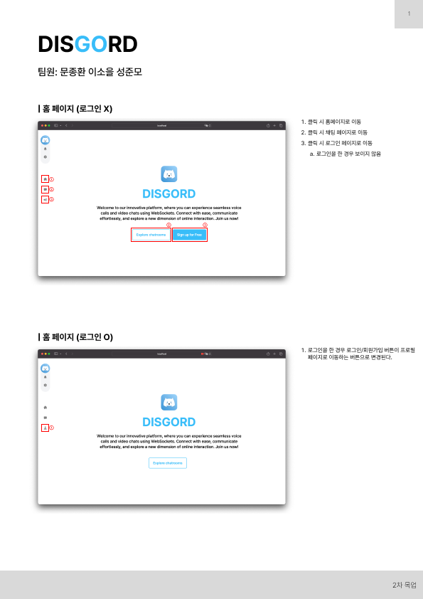
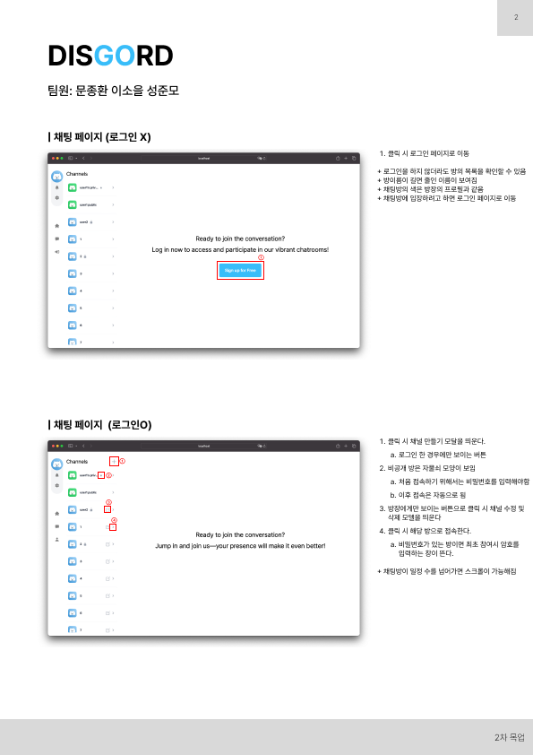
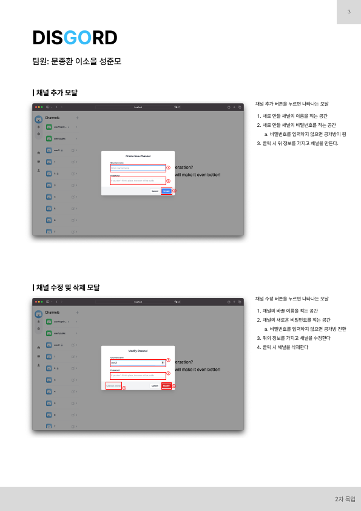
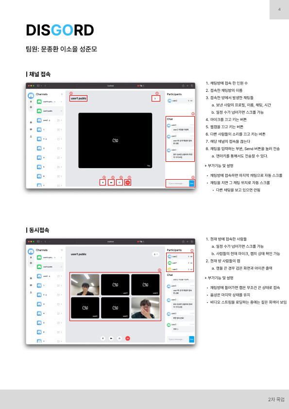
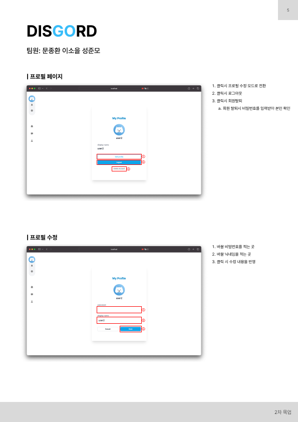
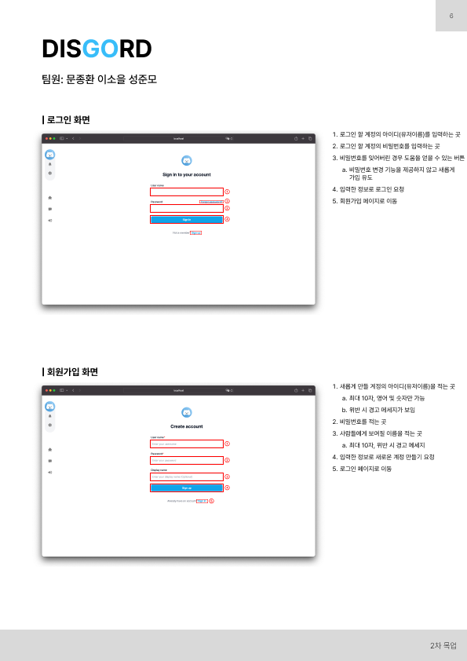

# PROJECT DISGORD

This project is a Discord-like application built using vanilla WebSocket for real-time communication and WebRTC for peer-to-peer media streaming. The application allows users to join chat rooms, participate in video calls, and send messages in real time.

## Technologies Used

- Frontend: React, Typescript, Jotai
- Backend: [Go](https://github.com/nenene-pupupu/disgord-server)
- WebSocket: Vanilla WebSocket API
- WebRTC: Vanilla WebRTC API
- Styling: Tailwind CSS
- Authentication: JSON Web Tokens (JWT)
- Build Tools: Vite

## Installation

### Server

Before starting frontend,clone and start the backend server:

```bash
git clone https://github.com/nenene-pupupu/disgord-server.git
cd disgord-server
go run main.go
```

> Go and see [SERVER README](https://github.com/nenene-pupupu/disgord-server) for more detail

### Prerequisites

- **Node.js**: v20.12.2
- **npm**: v9.9.3

### Client

Installation:

1. Clone the repository:

```bash
git clone https://github.com/nenene-pupupu/disgord-client.git
cd disgord-client
```

2. Install dependencies:

```bash
npm install
```

3. Set up environment variables:
   Create a .env file in the root directory and add the necessary environment variables.

```bash
VITE_SERVER_URL = "localhost:8080"
```

4. Start the development server:

```bash
npm run dev
```

5. Access the application at http://localhost:5173

> Note: Because of audio, webcam, cookie access, you must access through this URL

> Tip: Press **o** with the shortcut key and the browser will turn on immediately

## Mockup







